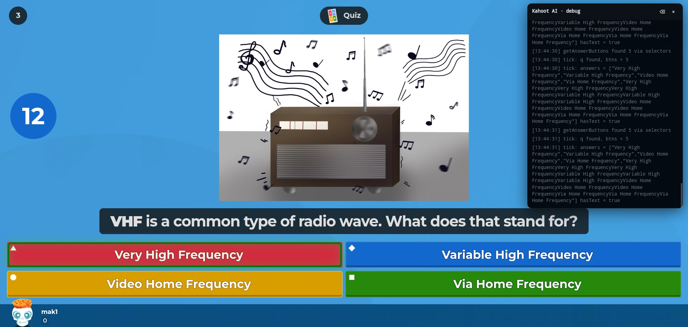
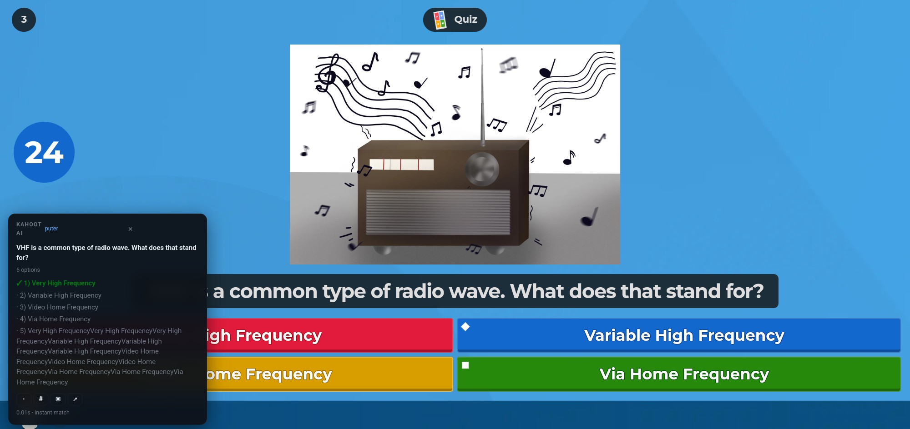
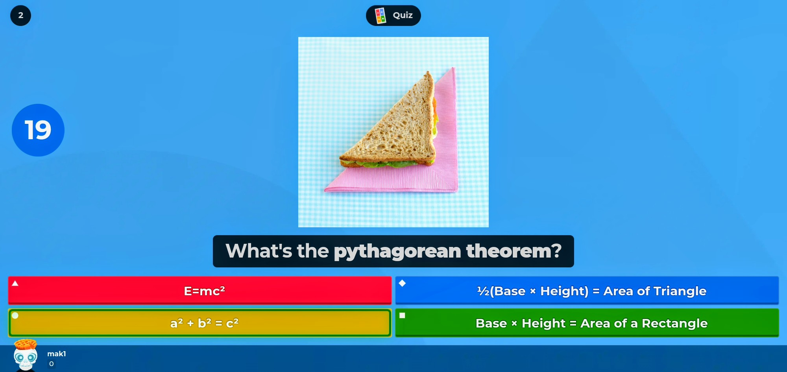

# Kahoot AI Helper

AI-powered assistant for Kahoot! quizzes. It reads the live question and answer options from `kahoot.it`, asks your chosen AI provider for the correct answer, and shows it on screen in a display mode of your choice.

## Screenshots

| Highlight Mode & Debug | Floating Info Panel | Highlight mode |
|:---:|:---:|:---:|
|  |  |  |

## Features

- **Real-time detection** – scans the page for the current question and answer buttons as the quiz progresses.
- **Multiple AI providers** – choose between Google AI Studio, OpenRouter, or Puter.
- **Two-phase flow** – optionally prefetch the question before the options appear, then match the AI hint to the numbered answers once they are visible.
- **Display modes**:
  - Dot on the correct answer
  - Highlight border on the correct answer
  - Corner number badge
  - Floating info panel
  - Browser notification
- **Debug panel** – optional on-page log for troubleshooting.
- **Robust DOM detection** – works with both classic selectors and Kahoot's hashed styled-components classes on the mobile player view.

## Supported providers

| Provider | API key | Notes |
|----------|---------|-------|
| Puter | Not required | Free tier; sign in through Puter once in the browser. |
| Google AI Studio | Required | Free tier available at aistudio.google.com. |
| OpenRouter | Required | Free model options available at openrouter.ai. |

## Installation

1. Download and unzip the extension package.
2. Open Chrome or Edge and navigate to `chrome://extensions` (or `edge://extensions`).
3. Enable **Developer mode** in the top-right corner.
4. Click **Load unpacked** and select the unzipped extension folder.
5. Join a Kahoot game and open the extension popup to select your provider and display mode.

## How it works

1. The content script detects the question text and answer buttons on the page.
2. If prefetch is enabled, the question is sent to the AI immediately to get a short answer hint.
3. Once the answer options appear, the AI is asked to pick the correct option number (or the prefetch hint is matched against the options to save a request).
4. The chosen answer is displayed in the selected mode and cleared automatically when the next question loads.

## Privacy

- The extension runs only on `kahoot.it` pages.
- API keys are stored locally in the browser via `chrome.storage` and are sent only to the chosen provider's API.
- Puter authentication is handled by the official Puter.js script in the page context; the extension itself does not access credentials.

## License

MIT
